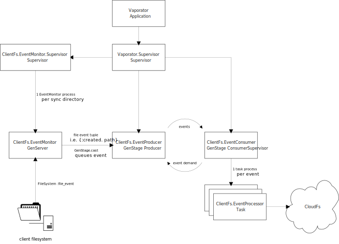

# Vaporator

## Setting Up

### Configuration variables

- `:dbx_token` - the API key for Dropbox
- `:clientfs_sync_dirs` - the local client directories to be synchronized by
  Vaporator
- `:cloudfs_root` - the cloud filesystem path into which all files
  will be synchronized
- `:poll_interval` - number of seconds between polling clientfs and cloudfs state.

### Separate environment config files

There are now three environment configuration files in the `config`
directory to be populated as needed for their corresponding
environments:

- `test.exs`
- `dev.exs`
- `prod.exs`

### `instance.exs` Configuration File

You must create the `config/instance.exs` file. This configuration is
for instance-specific settings. It will contain at least the following
application environment variables:

- `:dbx_token`
- `:clientfs_sync_dirs`
- `:cloudfs_root`
- `:poll_interval`

## Architecture

## Vaporator.ClientFs

Receives and processes events from the client filesystem to a cloud filesystem

### ClientFs.EventMonitor
**Type:**
[GenServer](hexdocs.pm/elixir/GenServer.html)

`ClientFs.EventMonitor` polls the current state of `clientfs` and `cloudfs` and updates `cloudfs` where states differ.

Directories that will be monitored can be provided as a list of
binaries of **absolute paths** in the application variable
`:sync_dirs`. This will be set explicitly in either one of the
environment config files (`{test,dev,prod}.exs`) or in the
instance-specific environment config, `instance.exs`.

### Vaporator.Cache
**Type:**
[GenServer](hexdocs.pm/elixir/GenServer.html), 
[ETS](https://hexdocs.pm/ets/Ets.html)

`Vaporator.Cache` provides an interface to the ets file hash cache.

### ClientFs.EventProducer
**Type:**
[GenStage.BroadcastDispatcher
](https://hexdocs.pm/gen_stage/GenStage.Dispatcher.html) (Producer)

#### Event Queue
Receives file events from `ClientFs.EventMonitor` and stores them using an 
[erlang queue](http://erlang.org/doc/man/queue.html).

#### Event Demand
When `ClientFs.EventConsumer` requests events for processing, 
`ClientFs.EventProducer` dequeues the number of requested 
events and responds with the events.

### ClientFs.EventConsumer
**Type:**
[GenStage ConsumerSupervisor
](https://hexdocs.pm/gen_stage/ConsumerSupervisor.html)

`ClientFs.EventConsumer` receives events from `ClientFs.EventProducer` and 
spawns one `ClientFs.EventProcessor` per event for concurrent processing.

### ClientFs.EventProcessor
**Type:**
[Task](https://hexdocs.pm/elixir/Task.html)

`ClientFs.EventProcessor` is spawned by `ClientFs.EventConsumer` to process 
a single event using `Vaporator.ClientFs.process_event/1` to call the necessary 
`Vaporator.CloudFs` sync function.
